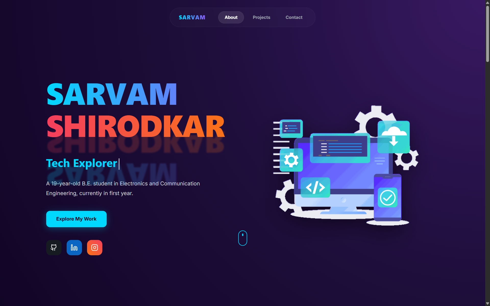
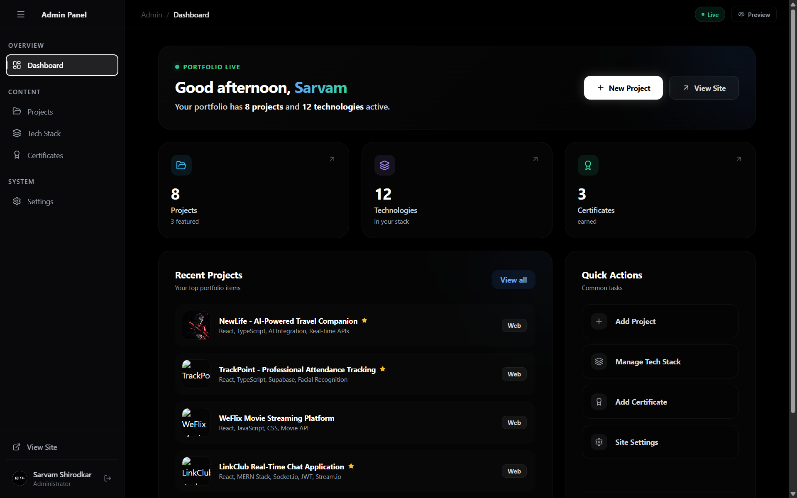

# 🚀 Sarvam Shirodkar — Developer Portfolio

A modern, high-performance developer portfolio built with a focus on **clean UI, smooth animations, and full control through an admin dashboard**.

---

## 🌐 Live Demo

👉 https://your-vercel-link.vercel.app

---

## 🎥 Demo Preview


---

## 📸 Screenshots

### 🏠 Homepage



### 🛠 Admin Dashboard



---

## ✨ Features

* 🎯 Fully dynamic portfolio (no hardcoded data)
* 🧠 Admin dashboard to manage content
* 🎨 Dark glassmorphic UI design
* ⚡ Smooth animations with Framer Motion
* 🖼 Image upload via Cloudinary
* 📩 Contact system using EmailJS
* 🔐 Firebase authentication & database

---

## 🛠 Tech Stack

* **Frontend:** React + Vite + TypeScript
* **Styling:** Tailwind CSS
* **Animations:** Framer Motion
* **State:** Zustand
* **Backend:** Firebase (Firestore + Auth)
* **Image Storage:** Cloudinary
* **Email Service:** EmailJS

---

## 💻 Run Locally

```bash
npm install
npm run dev
```

---

## 🔐 Admin Panel

Go to:

```
/admin
```

Login with your Firebase credentials to manage your portfolio.

---

## ⚙️ Environment Variables

Create a `.env` file:

```env
# Firebase
VITE_FIREBASE_API_KEY=
VITE_FIREBASE_AUTH_DOMAIN=
VITE_FIREBASE_PROJECT_ID=
VITE_FIREBASE_STORAGE_BUCKET=
VITE_FIREBASE_MESSAGING_SENDER_ID=
VITE_FIREBASE_APP_ID=

# Cloudinary
VITE_CLOUDINARY_CLOUD_NAME=
VITE_CLOUDINARY_UPLOAD_PRESET=

# EmailJS
VITE_EMAILJS_SERVICE_ID=
VITE_EMAILJS_TEMPLATE_ID=
VITE_EMAILJS_PUBLIC_KEY=
```

---

## 🚀 Deployment

Deployed on **Vercel**

Steps:

1. Push code to GitHub
2. Import repo in Vercel
3. Add environment variables
4. Deploy

---

## 🧠 What I Learned

* Building a full-stack portfolio
* Firebase authentication & database security
* Cloudinary integration
* EmailJS setup
* Deployment on Vercel

---

## 📬 Connect With Me

* Instagram: https://instagram.com/yourusername
* LinkedIn: https://linkedin.com/in/yourusername
* GitHub: https://github.com/Sarvam96k

---

⭐ If you like this project, consider starring the repo!
